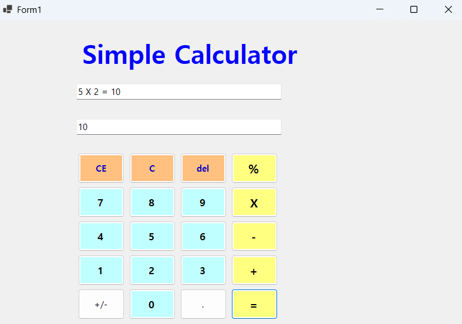
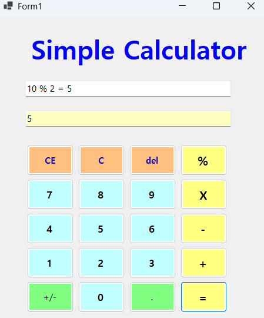
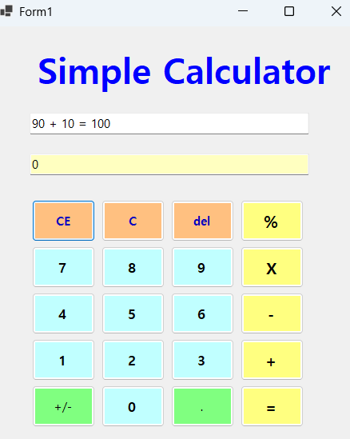

# (C# 코딩) 에코 메신저 ## 개요
- C# 프로그래밍 학습

- 1줄 소개: 사용자가 textbox에 계산하고 싶은 숫자와 기호를 작성하면 계산된 결과값이 나타나게 된다
- 사용한 플랫폼: 
- C#, .NET Windows Forms, Visual Studio, GitHub
- 사용한 컨트롤:
- Label, TextBox, Button
- 사용한 기술과 구현한 기능:
- 창에 나오는 버튼 또는 키보드에 있는 숫자 또는 기호를 누르면 textbox에 나오게 구현함
- =을 입력하면 textbox에 있는 숫자들을 계산하여 계산한 값을 textbox에 나타나게 구현
- 계산기의 C, EC, del 버튼을 구현함
- 실습 중에 구현한 기능들 설명
-
-
## 실행 화면 (과제1)
- 과제1 코드의 실행 스크린샷

- 과제 내용
-label과 textbox, button을 구성
-button 에 있는 숫자들을 클릭 시 위 텍스트박스에 나타나게 구현

## 실행 화면 (과제2)
- 과제2 코드의 실행 스크린샷

- 과제 내용
-빼기,곱하기,나누기 구현
-빼기(-), 곱하기(X). 나누기(%) 버튼 구현과 계산 구현

## 실행 화면 (과제3)
- 과제3 코드의 실행 스크린샷

- 과제 내용
- C,EC,del 버튼 구현
- c 버튼 클릭 시 현재 모든 내용을 삭제하고 처음으로 돌아가는 초기화 상태로 만듬
- EC 버튼 클릭 시 현재 입력하고 있는 택스트값을 모두 지움
- del 버튼 클릭 시 현재 입력하고 있는 택스트의 마지막 값 하나를 지움

## 실행 화면 (과제4)
- 과제4 코드의 실행 스크린샷

- 과제 내용
- 키보드로 숫자와 기호가 눌리게 변경
- 